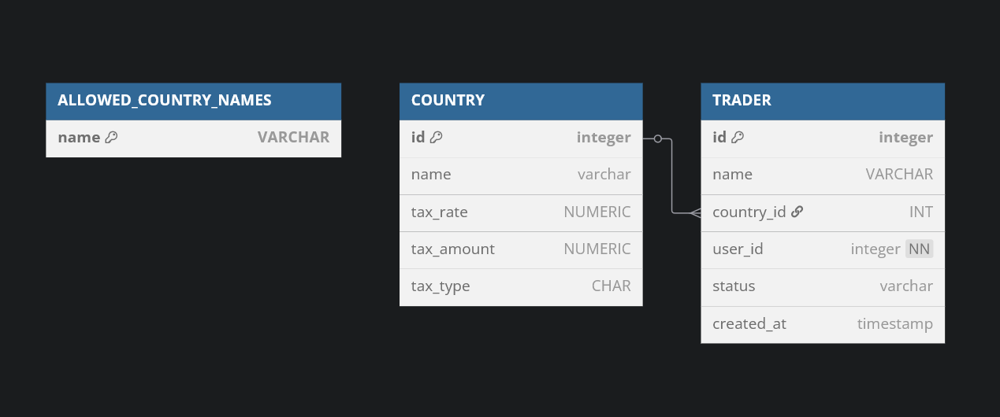
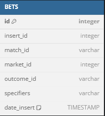

# Paurus home assigment

## Task 1 - REST API example

This project exposes RESTful APIs for managing Countries and Traders, and estimating possible bet return amounts after taxation.

### Run the app


### Run the tests


### Calculating the Best Possible Bet Return Amount

Taxation is calculated using one of the two types supported by the country in which the trader operates:

- **General ('G')**: Taxes the entire bet (played amount + winnings).
- **Winnings ('W')**: Taxes only the winnings
  
Each country only supports **one** type of taxation.

#### Taxation Methods

Each tax type has two methods of taxation that apply to the amount taxed by each taxMethod, which lowers the possible return amount:

- **Rate**: 
  `possible return amount = possible return amount - (amount taxed * rate)`
- **Amount**: 
  `possible return amount = possible return amount - amount`

- A country can support **both methods of taxation** or just **one**.

- A trader always chooses the taxation method that provides the **best possible return amount**.

### Example

- **Amount bet** = 5  
- **Odd** = 1.5  
- **Return amount before tax** = 7.5

#### Country A (General Taxation)

- **Tax Type**: General (G)
- **Rate**: 10%
- **Amount**: 2

**Possible return amount after tax in Country A**:

- Amount to be taxed = 7.5
- With rate taxMethod: `7.5 - (7.5 * 0.1) = 6.75` (best possible return amount after tax)
- With amount taxMethod: `7.5 - 2 = 5.5`

#### Country B (Winnings Taxation)

- **Tax Type**: Winnings (W)
- **Rate**: 10%
- **Amount**: 2

**Possible return amount after tax in Country B**:

- Amount to be taxed = `7.5 - 5 = 2.5` 
- With rate taxMethod: `7.5 - (2.5 * 0.1) = 7.25` (best possible return amount after tax)
- With amount taxMethod: `7.5 - (2.5 - 2) = 5.5`

### DB Schema

The application uses an in-memory H2 database

#### ALLOWED_COUNTRY_NAMES: 
- Stores a list of allowed country names.
#### COUNTRY
- Represents a country that traders can belong to.
#### TRADER
- Represents a trader belonging to a specific country



### API Endpoints

#### 1. Country API (/api/countries)

Method | Endpoint | Description
| ------------- | ------------- | ------------- |
GET | /api/countries | Fetch all countries
GET | /api/countries/{id} | Fetch a country by ID
GET | /api/countries/allowedCountryNames | Fetch all allowed country names
POST | /api/countries/createCountry | Create a new country
PUT | /api/countries/{id} | Update an existing country
DELETE | /api/countries/{id} | Delete an existing country


Notes:

    Country creation only allows countries from a pre-approved list (AllowedCountryNames).

    Either taxRate or taxAmount (or both) must be provided when creating or updating a country.

    TaxType must be either:

        'W' for taxing winnings

        'G' for taxing the entire bet (general)

#### 2. Trader API (/api/traders)


Method | Endpoint | Description
| ------------- | ------------- | ------------- |
GET | /api/traders | Fetch all traders
GET | /api/traders/{id} | Fetch a trader by ID
POST | /api/traders/createTrader | Create a new trader
PUT | /api/traders/{id} | Update an existing trader
DELETE | /api/traders/{id} | Delete an existing country
POST | /api/traders/calculatePossibleBetReturnAmount | Calculate the possible bet return amount after tax

Notes:

    Trader creation requires selecting an existing country.

    Trader names can be reused across different countries (unless additional uniqueness is implemented).

    Bet Return Calculation uses:

        Country's taxation type (W or G).

        And picks the best available tax taxMethod (rate vs. fixed amount) for the best possible return.

#### Example API calls

##### Create a country

###### Request

`POST /api/countries/createCountry`

```json
{
  "name": "Hungary",
  "taxRate": 0.15,
  "taxType": "G"
}
```

###### Response

```json
{
    "data": {
        "id": 4,
        "name": "Hungary",
        "taxRate": 0.15,
        "taxAmount": null,
        "taxType": "G"
    },
    "message": "Country created successfully",
    "timestamp": "2025-04-27T11:09:26.760+00:00",
    "successful": true,
    "status": 200
}
```


##### Create a trader 

###### Request

`POST /api/traders/createTrader`

```json
{
  "name": "John Doe",
  "countryId": 1
}
```

###### Response

```json
{
    "data": {
        "id": 7,
        "name": "Trader X",
        "country": {
            "id": 1,
            "name": "Slovenia",
            "taxRate": 0.1,
            "taxAmount": 1.0,
            "taxType": "W"
        }
    },
    "message": "Trader created successfully",
    "timestamp": "2025-04-27T11:12:40.750+00:00",
    "successful": true,
    "status": 200
}
```


##### Calculate Possible Bet Return

###### Request

`POST /api/traders/calculatePossibleBetReturnAmount`

```json
{
    "traderId": "2",
    "playedAmount": 2,
    "odd": "1.5"
}
```

###### Response

```json
{
    "data": {
        "possibleReturnAmountBefTax": 3.0,
        "possibleReturnAmountAfterTax": 2.7,
        "taxRate": 0.1,
        "taxAmount": null
    },
    "timestamp": "2025-04-27T11:15:26.132+00:00",
    "successful": true,
    "status": 200
}
```

##### Error Response Format example

```json
{
    "data": {
        "traderId": "must not be null"
    },
    "error": "Parameter validation failed",
    "timestamp": "2025-04-27T11:16:23.226+00:00",
    "successful": false,
    "status": 400
}
```


## Task 2 - Inserting data into the database in ordered manner

### Problem


We have a dataset with four columns: `MATCH_ID`, `MARKET_ID`, `OUTCOME_ID`, and `SPECIFIERS`.

The goal is to insert this data into the database as fast as possible, while maintaining **ascending order within each `MATCH_ID` group**.

After the data is inserted, if we sort it by `MATCH_ID` and the insertion timestamp (`date_insert`), it should appear in ascending order for all grouped data.

---

### Solution

To preserve the intended order, the dataset must first be pre-sorted before insertion.

Since ordering is only required **within each `MATCH_ID`**, we can take advantage of this by grouping the data hierarchically:

- Group by `MATCH_ID`
  - Then by `MARKET_ID`
    - Then by `OUTCOME_ID`
      - Each `OUTCOME_ID` has a list of `SPECIFIERS`

To achieve this, I created a **nested structure**:

```
ListOfMatches(Match, ListOfMarkets(Market, ListOfOutcomes(...)))
```

Then withing each `MATCH_ID` I sorted

- the `SPECIFIERS` for each `OUTCOME_ID`
- then `OUTCOME_IDs` within a `MARKET_ID`
- then `MARKET_IDs` 

After unpacking the sorted structure back into flat rows, I performed the insertion.

Because batch inserts evaluate the default timestamp **once per statement**, I changed the `date_insert` column to use `clock_timestamp()` which evaluates per row instead of `now()` which evaluates once per transaction.

---

### DB schema

To ensure that rows were inserted in the correct sorted order, I added two additional fields to the BETS table:





- `id`: an auto-incrementing primary key generated by a sequence

- `insert_id`:a manually assigned value indicating the insertion order of each record (i.e., the first match to be inserted gets 1, the second 2, and so on)

The insert_id was set programmatically during the data insertion process to reflect the intended order of all the records once the data has been sorted and unpacked.

After inserting all the data, I validated the insertion order by confirming that for every record the id and insert_id matched.

---


### Methods for saving data

| Method                   | Time (approx.) |
|--------------------------|----------------|
| Row-by-row `.save()`     | Too slow       |
| Batch insert with `saveAll()` | ~10s           |
| Prepared statements      | ~8s            |
| PostgreSQL `COPY` method | ~1.5s          |

- Row-by-row `.save()` was the slowest and was not worth completing.
- `saveAll()` and prepared statements with a batch size of 1 million rows performed well.
- The PostgreSQL `COPY` command was the fastest overall, completing in about 1 second. Min and max for date_insert and their difference are presented below

| Min(date_insert) | Max(date_insert) | Total time (s)
|-|-|-|
| 2025-04-30 10:42:51.165334 |	2025-04-30 10:42:52.328474 |	1.16314


---

### Answer to the task question

#### What can be done to speed up the process of writing it to the output?

In my solution I tried my best to remove any redundant sorting by creating a nested structure. That did not appear to be the bottle neck in this task but the time it takes to save the records into the DB was.

- Sorting the 350k rows took  around 150ms.
- Writing the data ranged from 25s with batch inserts down to 1s with `COPY`.

If we had much more data to insert we could:

- Track how many rows each `MATCH_ID` has in advance.
- Group `matches` in a way that each group has a similar number of rows to process
- Sort the first group and `COPY` it into the db. While it's transfering data to the db start sorting the next group and so on.
- We need to keep in mind that `COPY` works best with a large number of rows and we need to be mindful of the number of connections we have open.

