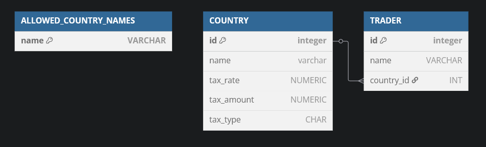

# Paurus home assigment


## Prerequisites

- Java JDK 24 (24.0.1)
- Maven (tested with version 3.9.9)
- Docker (for running the Postgres DB)
---
### Clone the project

```bash
git clone https://github.com/SnowX65/paurus_home_assigment
cd paurus_home_assigment
```

### Build the project and install package files

```console
# Build and install with tests
mvn install

# Build and install without tests and run them separately
mvn install -Dmaven.test.skip.exec
mvn test
```
### Docker

Each time you run the application a docker container for the database 
will automatically start.

Before starting the application make sure that Docker is running. 

When running the application for the first time it will create a docker container automatically 
and initialize the dabase from the ./init/schema.sql file.

### Run and test the application

```bash
# Run the web server (Task 1)
mvn spring-boot:run

# Run Task 2 (first argument is -f 2nd is the path to the file containing all the rows)
mvn spring-boot:run  -Dspring-boot.run.arguments="-f C:\Users\go8605\Desktop\fo_random.txt"
```

---

## Task 1 - REST API example

This project exposes RESTful APIs for managing Countries and Traders, and estimating possible bet return amounts after taxation.

---

### Calculating the Best Possible Bet Return Amount

Taxation is calculated using one of the two types supported by the country in which the trader operates:

- **General ('G')**: Taxes the entire bet (played amount + winnings).
- **Winnings ('W')**: Taxes only the winnings

Each country only supports **one** type of taxation.

#### Taxation Methods

Each tax type has two methods of taxation that apply to the amount taxed by each taxMethod, which lowers the possible return amount:

- **Rate**:
  `possible return amount = possible return amount - (amount taxed * rate)`
- **Amount**:
  `possible return amount = possible return amount - amount`

- A country can support **both methods of taxation** or just **one**.

- A trader always chooses the taxation method that provides the **best possible return amount**.

### Example

- **Amount bet** = 5
- **Odd** = 1.5
- **Return amount before tax** = 7.5

#### Country A (General Taxation)

- **Tax Type**: General (G)
- **Rate**: 10%
- **Amount**: 2

**Possible return amount after tax in Country A**:

- Amount to be taxed = 7.5
- With rate taxMethod: `7.5 - (7.5 * 0.1) = 6.75` (best possible return amount after tax)
- With amount taxMethod: `7.5 - 2 = 5.5`

#### Country B (Winnings Taxation)

- **Tax Type**: Winnings (W)
- **Rate**: 10%
- **Amount**: 2

**Possible return amount after tax in Country B**:

- Amount to be taxed = `7.5 - 5 = 2.5`
- With rate taxMethod: `7.5 - (2.5 * 0.1) = 7.25` (best possible return amount after tax)
- With amount taxMethod: `7.5 - (2.5 - 2) = 5.5`

---

### DB Schema

The application uses a Postgres DB run in a docker container

#### ALLOWED_COUNTRY_NAMES:
- Stores a list of allowed country names.
#### COUNTRY
- Represents a country that traders can belong to.
#### TRADER
- Represents a trader belonging to a specific country



---

### API Endpoints

Web server is accessible on localhost port 8080

`http://localhost:8080`

#### 1. Country API

**Base URL:** `/api/countries`


| Method | Endpoint               | Description                       | Request Body Parameters                                                                                                                      | Notes                                                                                                |
|--------|------------------------|-----------------------------------|----------------------------------------------------------------------------------------------------------------------------------------------|------------------------------------------------------------------------------------------------------|
| GET    | `/`                    | Returns all countries             |                                                                                                                                              |                                                                                                      |
| GET    | `/{id}`                | Returns a single country by ID    |                                                                                                                                              |                                                                                                      |
| GET    | `/allowedCountryNames` | Lists allowed country names       |                                                                                                                                              | Check the names when updating or creating a new country                                              |
| POST   | `/createCountry`       | Creates a new country             | `name` (String, required, must match allowed names) <br><br>   `taxRate` (Double, optional)  <br><br>  `taxAmount` (Double, optional) <br><br>  `taxType` (`W` or `G`) | Either `taxRate` or `taxAmount` **must** be provided (both can be provided but only one can be null) |
| PUT    | `/{id}`                | Updates an existing country by ID | `taxRate` (Double, optional)  <br><br>  `taxAmount` (Double, optional) <br><br>  `taxType` (`W` or `G`, optional)                                             | When done updating at least one of `taxRate` or `taxAmount` must be set                              |
| DELETE | `/{id}`                | Deletes a country by ID           |                                                                                                                                              |                                                                                                      |

Notes:

    Country creation only allows countries from a pre-approved list (AllowedCountryNames).

    Either taxRate or taxAmount (or both) must be provided when creating or updating a country.

    TaxType must be either:

        'W' for taxing winnings

        'G' for taxing the entire bet (general)

#### 2. Trader API (/api/traders)


| Method | Endpoint                            | Description                         | Request Body Parameters                                                 | Notes                                                                                                                                                                                                                                                                                                                                                                                                                          |
|-------------|-------------------------------------|-------------------------------------|-------------------------------------------------------------------------|--------------------------------------------------------------------------------------------------------------------------------------------------------------------------------------------------------------------------------------------------------------------------------------------------------------------------------------------------------------------------------------------------------------------------------|
| GET         | `/`                                 | Returns a list of all traders.      |                                                                         |                                                                                                                                                                                                                                                                                                                                                                                                                                |
| GET         | `/{id}`                             | Returns a single trader by ID       |                                                                         |                                                                                                                                                                                                                                                                                                                                                                                                                                |
| POST        | `/createTrader`                     | Creates new trader                  | `name` (String) <br><br>  `countryId` (Long)<br>                            | Two traders cannot have the same name in one country                                                                                                                                                                                                                                                                                                                                                                           |
| PUT         | `/{id}`                             | Updates an existing trader by ID    | `name` (String, optional) <br><br>  `countryId` (Long, optional)                 |                                                                                                                                                                                                                                                                                                                                                                                                                                |
| DELETE      | `/{id}`                             | Delete a trader by ID               |                                                                         |                                                                                                                                                                                                                                                                                                                                                                                                                                |
| POST        | `/calculatePossibleBetReturnAmount` | Uses trader's country tax rules to compute best return method | `traderId` (Long) <br><br>  `playedAmount` (Double)<br><br>  `odd` (Double)<br> | Returns: <br><br> `possibleReturnAmountBefTax`  best possible return before the tax is calculated <br><br> <br><br> `possibleReturnAmountAfterTax`  return after the tax is calculated <br><br> `taxRate`  the tax rate the trader uses<br><br> `taxAmount`  the tax amount the traders uses<br><br> `taxMethod` - `(amount/rate)`  which method the trader chose when calculating the possible return after tax |

Notes:

    Trader creation requires selecting an existing country.

    Trader names can be reused across different countries (two traders with the same name cannot be in the same country).

---
### Example API calls

##### Create a country

###### Request

`POST /api/countries/createCountry`

```json
{
  "name": "Hungary",
  "taxAmount": 2,
  "taxType": "G"
}
```

###### Response

```json
{
  "data": {
    "id": 4,
    "name": "Hungary",
    "taxRate": null,
    "taxAmount": 2,
    "taxType": "G"
  },
  "message": "Country created successfully",
  "timestamp": "2025-04-27T11:09:26.760+00:00",
  "successful": true,
  "status": 200
}
```


##### Create a trader

###### Request

`POST /api/traders/createTrader`

```json
{
  "name": "John Doe",
  "countryId": 4
}
```

###### Response

```json
{
  "data": {
    "id": 7,
    "name": "John Doe",
    "country": {
      "id": 4,
      "name": "Hungary",
      "taxRate": null,
      "taxAmount": 2,
      "taxType": "G"
    }
  },
  "message": "Trader created successfully",
  "timestamp": "2025-04-27T11:12:40.750+00:00",
  "successful": true,
  "status": 200
}
```


##### Calculate Possible Bet Return

###### Request

`POST /api/traders/calculatePossibleBetReturnAmount`

```json
{
  "traderId": "7",
  "playedAmount": 5,
  "odd": "1.5"
}
```

###### Response

```json
{
  "data": {
    "possibleReturnAmountBefTax": 7.5,
    "possibleReturnAmountAfterTax": 5.5,
    "taxRate": null,
    "taxAmount": 2,
    "taxMethod": "rate"
  },
  "timestamp": "2025-04-27T11:15:26.132+00:00",
  "successful": true,
  "status": 200
}
```


###### Request - bet is too small

```json
{
  "traderId": "7",
  "playedAmount": 2,
  "odd": "1.5"
}
```

###### Response

```json
{
  "data": {
    "TotalTax": 2.0,
    "ReturnAmount": 1.5
  },
  "error": "Tax amount exceeds the possible return",
  "timestamp": "2025-04-30T19:25:24.312+00:00",
  "successful": false,
  "status": 400
}
```

##### Error Response Format example

```json
{
  "data": {
    "traderId": "must not be null"
  },
  "error": "Parameter validation failed",
  "timestamp": "2025-04-27T11:16:23.226+00:00",
  "successful": false,
  "status": 400
}
```


## Task 2 - Inserting data into the database in ordered manner

### Problem


We have a dataset with four columns: `MATCH_ID`, `MARKET_ID`, `OUTCOME_ID`, and `SPECIFIERS`.

The goal is to insert this data into the database as fast as possible, while maintaining **ascending order within each `MATCH_ID` group**.

After the data is inserted, if we sort it by `MATCH_ID` and the insertion timestamp (`date_insert`), it should appear in ascending order for all grouped data.

---

### Solution

To preserve the intended order, the dataset must first be pre-sorted before insertion.

Since ordering is only required **within each `MATCH_ID`**, we can take advantage of this by grouping the data hierarchically:

- Group by `MATCH_ID`
  - Then by `MARKET_ID`
    - Then by `OUTCOME_ID`
      - Each `OUTCOME_ID` has a list of `SPECIFIERS`

To achieve this, I created a **nested structure**:

```
ListOfMatches(Match, ListOfMarkets(Market, ListOfOutcomes(...)))
```

Then withing each `MATCH_ID` I sorted

- the `SPECIFIERS` for each `OUTCOME_ID`
- then `OUTCOME_IDs` within a `MARKET_ID`
- then `MARKET_IDs`

After unpacking the sorted structure back into flat rows, I performed the insertion.

Because batch inserts evaluate the default timestamp **once per statement**, I changed the `date_insert` column to use `clock_timestamp()` which evaluates per row instead of `now()` which evaluates once per transaction.

---

### DB schema

To ensure that rows were inserted in the correct sorted order, I added two additional fields to the BETS table:


- `id`: an auto-incrementing primary key generated by a sequence

- `insert_id`:a manually assigned value indicating the insertion order of each record (i.e., the first match to be inserted gets 1, the second 2, and so on)

The insert_id was set programmatically during the data insertion process to reflect the intended order of all the records once the data has been sorted and unpacked.

After inserting all the data, I validated the insertion order by confirming that for every record the id and insert_id matched.

---


### Methods for saving data

| Method                   | Time (approx.) |
|--------------------------|----------------|
| Row-by-row `.save()`     | Too slow       |
| Batch insert with `saveAll()` | ~10s           |
| Prepared statements      | ~8s            |
| PostgreSQL `COPY` method | ~1.5s          |

- Row-by-row `.save()` was the slowest and was not worth completing.
- `saveAll()` and prepared statements with a batch size of 1 million rows performed well.
- The PostgreSQL `COPY` command was the fastest overall, completing in about 1 second. Min and max for date_insert and their difference are presented below

| Min(date_insert) | Max(date_insert) | Total time (s)
|-|-|-|
| 2025-04-30 10:42:51.165334 |	2025-04-30 10:42:52.328474 |	1.16314


---

### Answer to the task question

#### What can be done to speed up the process of writing it to the output?

In my solution I tried my best to remove any redundant sorting by creating a nested structure. That did not appear to be the bottle neck in this task but the time it takes to save the records into the DB was.

- Sorting the 350k rows took  around 150ms.
- Writing the data ranged from 25s with batch inserts down to around 1.5s with `COPY`.

If we had much more data to insert we could:

- Track how many rows each `MATCH_ID` has in advance.
- Group `matches` in a way that each group has a similar number of rows to process
- Sort the first group and `COPY` it into the db. While it's transfering data to the db start sorting the next group and so on.
- We need to keep in mind that `COPY` works best with a large number of rows and we need to be mindful of the number of connections we have open.

